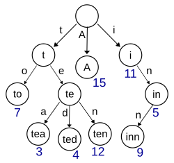

# SmartCode Workshop - Auto-suggestion system sample (C #+ VSCode)

[中文版](./README.md) | English

## Overview
In this example project, you will develop an application using Visual Studio Code. This application uses a dictionary to auto-complete words and provide spelling suggestions. 

You will use a pre-prepared project codebase that contains some initial code and common operations of the trie data structure. You will use the GitHub Copilot tool to assist in understanding, developing, and testing this code. 

## Project Background 
As a senior developer, you have just taken over this project called the Auto-Suggestion System (auto-suggestion). The features of this project include achieving rapid search for words that match the given prefix and providing auto-completion functionality by storing a large vocabulary of words. Additionally, this project also supports providing spelling suggestions for misspelled words.  

You have obtained an existing codebase that uses the trie data structure. This structure is a tree-based data structure and is very useful for prefix matching and auto-completion. You need to quickly familiarize yourself with this codebase and extend it to meet the requirements of the project team for the auto-recommendation system. 

## Regarding the trie data structure 
The following explanations come from wikipedia  https://zh.wikipedia.org/wiki/Trie
In computer science, a trie, also known as a prefix tree or dictionary tree, is an ordered tree used to store associative arrays, where the keys are typically strings. Unlike binary search trees, keys are not directly stored in nodes but are determined by the position of the nodes in the tree. All descendants of a node have the same prefix, which is the string corresponding to this node, and the root node corresponds to the empty string. Generally, not all nodes have corresponding values; only the keys corresponding to leaf nodes and some internal nodes have relevant values.  

The term "Trie" originates from "retrieval". The inventor of the trie, Edward Fredkin, pronounces it as /ˈtriː/ "tree". However, other authors pronounce it as /ˈtraɪ/ "try". 



In the illustration, keys are labeled within nodes, and values are labeled beneath nodes. Each complete English word corresponds to a specific integer. A Trie can be regarded as a deterministic finite automaton, although the symbols on the edges are generally implicit in the order of the branches. 

Keys do not need to be explicitly stored within nodes. The complete words labeled in the illustration are only for demonstrating the principle of the Trie. 
Keys in a Trie are usually strings, but they can also be other structures. The algorithm of the Trie can be easily modified to handle ordered sequences of other structures, such as a string of numbers or arrangements of shapes. For example, keys in a bitwise Trie are a string of bits and can be used to represent integers or memory addresses. Trie trees are often used in search suggestions. For example, when entering a website, possible options can be automatically searched. When there is no exact match in the search results, the most similar prefix can be returned. 

A Trie tree is actually a deterministic finite automaton (DFA), usually represented by a transition matrix. Rows represent states, columns represent input characters, and the position (row, column) represents the transition state. This method has high query efficiency but very low space utilization efficiency due to severe sparsity. 

The key feature of a Trie is that each node in the tree represents a single character of a string. The root node represents an empty string, and each path from the root node to a leaf node represents a complete word or string. Each node can contain multiple child nodes, and each child node corresponds to each possible character in the input alphabet. 

## Requirements 

You need to prepare the following environment in order to successfully complete this experiment: 
- Windows 10/11 or MacOS
- Git version 2.45 or above and the Git client you are familiar with 
  - https://git-scm.com/
- Visual Studio Code 1.90 or above
  - https://code.visualstudio.com/
- GitHub Copilot and GitHub Copilot Chat extensions
  - https://marketplace.visualstudio.com/items?itemName=GitHub.copilot
- The.Net 7.0 development environment and the basic understanding of the C# programming language 
  - https://dotnet.microsoft.com/en-us/download/dotnet/7.0
  - Please download the SDK version on the corresponding operating system 
  - Use the SDK instead of the Runtime 
- C# Dev Kit Extension
  - https://marketplace.visualstudio.com/items?itemName=ms-dotnettools.csdevkit
- Be familiar with classes, methods, variables and logical statements 

> Note on the development language: Although this example uses the C# language, it is also applicable to developers with any programming language background. Since GitHub Copilot supports basically any mainstream development language, the various operations and techniques demonstrated in this example are applicable to any development language environment. 

## Prepare the development environment 

Once you install the basic software as per the environmental requirements, you can obtain the code repository and configure the development environment. 

```shell
git clone https://github.com/smartcode-workshops/auto-suggest-csharp
```

Obtain the code and start the development environment by following the following operations 
1. Open Visual Studio Code and then click "Clone GitHub Repository" under the "Start" menu. 
2. In the "Clone from GitHub" field, enter the code repository address and then click "Clone from URL": 
3. In the pop-up window, create a new folder and select it as the repository destination. 
4. Wait for the project to be downloaded completely and then open the project. 
5. It may be necessary to confirm that you trust the author of the project in order to make the project run. 
6. Expand the TrieDictionary folder and open Program.cs. 

## Excercises

- Exercise 0 - Installation, Configuration, and Login of the AI Coding Assistant
- Exercise 1 - Use an AI coding assistant to quickly familiarize yourself with code
- Exercise 2 - Using AI Coding Assistant for Automatic Code Completion
- Exercise 3 - Improve the prompt words and let the AI coding assistant generate code that matches the intent
- Exercise 4 - Using AI Coding Assistant, Chat Debugging and Fixing Code
- Exercise 5 Generate unit test code using AI coding assistant
- Exercise 6 - Using the AI Coding Assistant to Generate Git Submit Comments

## Contact

If you encounter any problems in the process of using ** AI Coding Assistant **, or if you have any suggestions and feedback, please feel free to contact us. You can contact us in the following ways:

- website: https://leansoftx.com
- email: info@leansoftx.com
- wechat channel: DevOps
